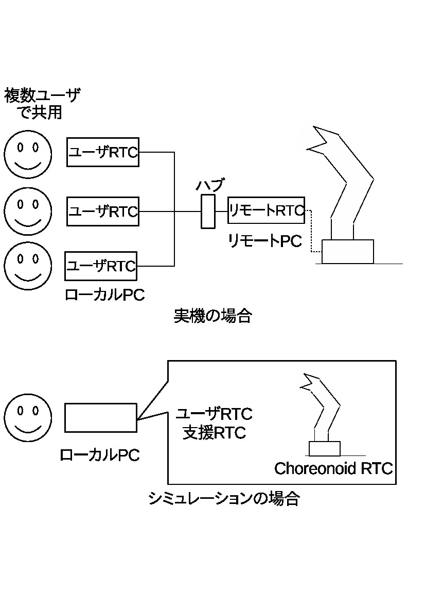
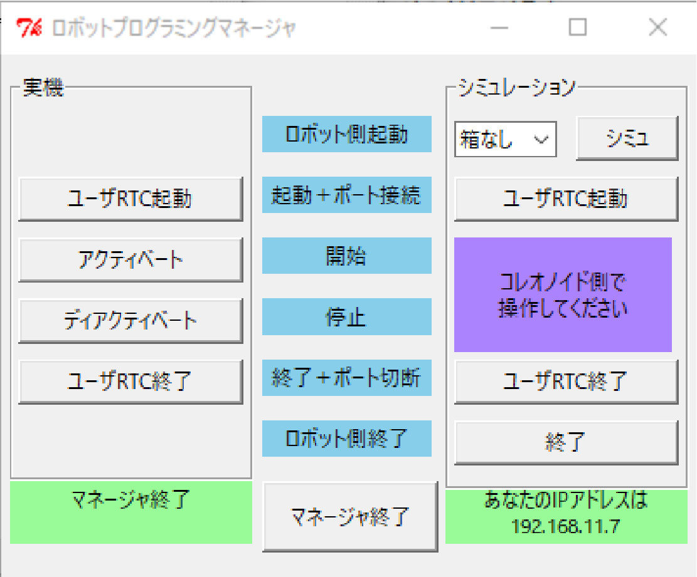

# 実機とシミュレータを併用するロボットプログラミング教材のための支援ツール

奥野 真之，升谷 保博  
大阪電気通信大学  
2017年12月4日  

<p>


</p> 

## 概要
ロボットプログラミングの学習では実機(車輪ロボット，ロボットアーム等)とシミュレータを切り替えることのできる教材が有用である．大阪電気通信大学では，RTミドルウェアとChoreonoidを利用してそのような教材を構成し授業を行っている．しかし，それらの標準のソフトウェアだけでは，操作が煩雑で学習の妨げになりやすく，実機を複数人で共用する場合にトラブルが起こりがちであった．そこでそのトラブルを解消する支援ツール，ロボットプログラミングマネージャ(RPM)を作成した．

本リポジトリの内容は，[RTミドルウェアコンテスト2017](http://openrtm.org/openrtm/ja/content/rtmcontest2017)にエントリしている[作品](http://www.openrtm.org/openrtm/ja/project/contest2017_01)です．

## 特徴
- 実機とシミュレーションを切り替えて使うことができる．
- 実機RTCを複数PCのRTCから共用することを想定している．
- コマンドラインやRT Sysytem Editorを使わずに，GUIのボタンでRTミドルウェアで必要な操作を行うことができる．
- 設定ファイルによって様々なRTCの組み合わせに対応できる．
- WindowsでもLinuxでも動作する．
## 操作の概要
OpenRTMに必要な操作，コンポーネント起動，接続，アクティベート，ディアクティベート，終了をする．ユーザは基本的にボタンを上から下に押していくだけでそれを行っている．
図のように実機の場合はロボット1に対しユーザ多を，シミュレーションの場合は自分のPC(ローカルPC)のみ，の環境を想定している．（上図）

<p></p> 

## 必要なソフトウェア
- python2.7.10 https://www.python.org/
- TkInter https://wiki.python.org/moin/TkInter
- RTCTree https://github.com/gbiggs/rtctree 
- pyYAML(python 2.7に準ずるならバージョンを問わず) https://github.com/yaml/pyyaml

## 前提環境
- Windows
- Linux

## 用語説明
- ローカルPC
  - ユーザが操作するPC．
- リモートPC
  - 実機を動かすPC．
- ユーザRTC
  - ローカルPCで動作するRTC
- リモートRTC
  - リモートPCで動作するRTC
- 支援RTC
  - シミュレーション時に使うRTC
- Choreonoid RTC
  - ボディRTCやボディRTCのコントローラモジュールのRTC

## 準備(教材を準備する側)
- リモートPC側の準備
  - リモートRTCをReleaseでビルド
  - 固定のIPアドレスに設定
- 受講生に提供する教材 
  - 各RTCの準備とRPMやChoreonoidの設定ファイルの設定を行う．
  - ボディRTCのコントローラモジュールの注意点
    - Windows: Releaseでビルドし，その後必ずINSTALLをビルド．
    - Linux: makeした後make install 
  - 設定ファイルの記述
    - 詳細は[config.md](https://github.com/MasutaniLab/robot-programming-manager/blob/master/config.md)や同リポジトリのyamlファイルを参照
詳細は仕様書，事例1，事例2のドキュメント参照


## 準備(受講生側)
- インストール
  - OpenRTM
  - Python2.7.10
  - pyYAML
- 全RTCの準備
  - CMake,make


## 実機
- 利用するPCは2台．
  - 実機側（リモートPC）： 実機を動かすためのPC．実機用のRTC(リモートRTC)はここで実行．
  - ユーザ側（ローカルPC）： ユーザのRTC(ユーザRTC)をここで実行．

### リモートPC準備

- IPアドレスを固定
- ネームサーバ起動
- リモートRTC起動
    - リモートRTC間の接続はRT System Editor等で済ませる

### 操作
- ローカルPCでRPM起動
- "ユーザRTC起動"で設定ファイルに書かれてる```common```の```command```が立ち上がり，問題がなければ接続完了と表示される
- "アクティベート"，"ディアクティベート"で全RTCがアクティベート，ディアクティベートになる
- "ユーザRTC終了"でユーザRTCが閉じる

## シミュレーション
- 利用するPCは1台
  - ローカルPCでユーザRTCとサポートRTC（実機ではリモートRTC）を一括操作

### 操作
- コンボボックスで設定ファイルに書かれてるプロジェクトファイルを切り替えれる
- "シミュ"でChoreonoidとサポートRTCを起動
- "ユーザRTC起動"で設定ファイルに書かれてる```common```の```command```が立ち上がり，問題がなければ接続完了と表示される
- アクティベート，ディアクティベートはChoreonoidに任せる
- "ユーザRTC終了"でユーザRTCが閉じる


# 仕様書 
- https://github.com/MasutaniLab/robot-programming-manager/blob/master/RPMspecification.md


# 設定ファイルの仕様
- https://github.com/MasutaniLab/robot-programming-manager/blob/master/config.md


# 事例1
- https://github.com/MasutaniLab/robot-programming-manager/blob/master/sample1.md


# 事例2
- https://github.com/MasutaniLab/robot-programming-manager/blob/master/sample2.md
