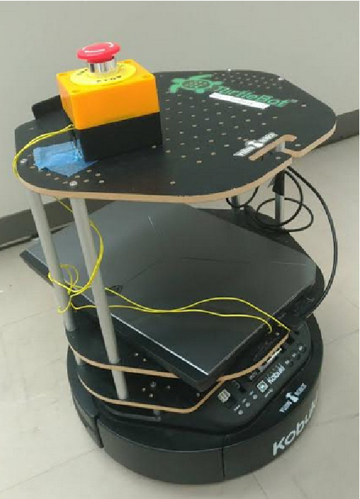
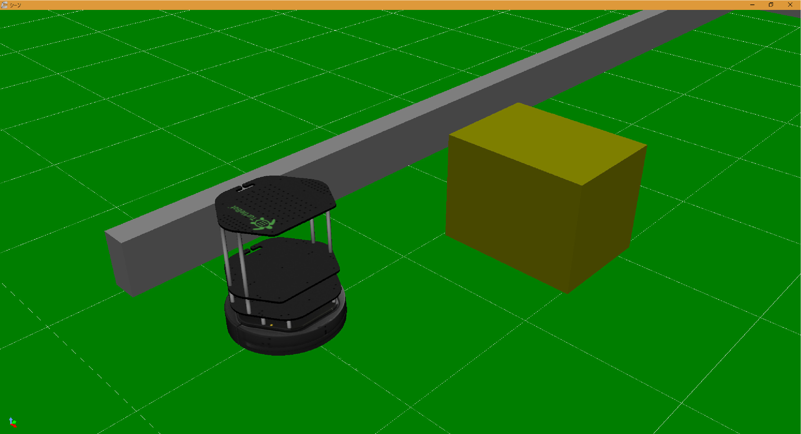
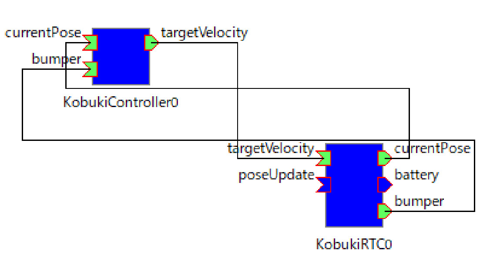
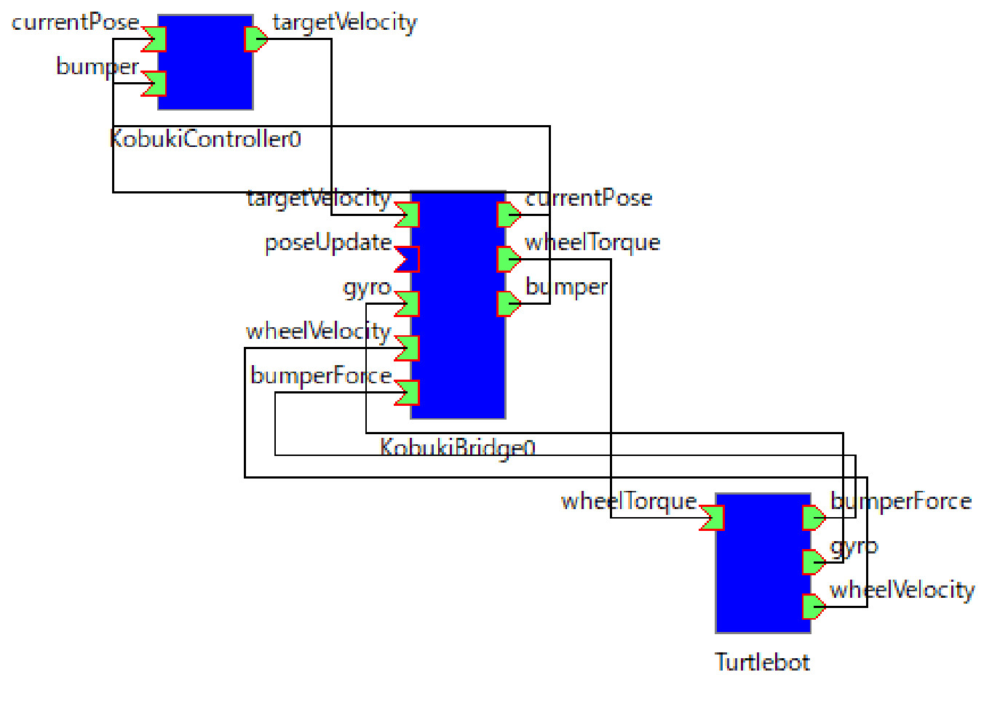

# 事例1: 移動ロボットKobuki（Turtlebot）のバンパセンサを使った障害物回避

奥野 真之，升谷 保博  
大阪電気通信大学  
2017年12月4日  

## 概要
Yujin Robot 社の車輪型移動ロボットKobukiのバンパーセンサを使用し，移動ロボットの誘導と障害物回避のプログラミングを学ぶ教材である．

 

 

※ Windowsの開発環境はすべてVisual Studio 2012,Ubuntu16.04の64bitで動作確認

※ ローカルPCの動作はWindows,Ubuntuで動作確認したが，リモートPCはWindowsのみ

### 準備物
インストール方法は各サイトを参照．
- eggx(Linux)
  - http://www.ir.isas.jaxa.jp/~cyamauch/eggx_procall/index.ja.html
- wineggx(Windows)
  - RPMのリポジトリのサブモジュールになっている．
  - https://github.com/MasutaniLab/wineggx
- kobukiRTC
  - https://github.com/rt-net/kobuki_rtc

### 設定ファイル
事例1で使う設定ファイル．

- Windows
  - https://github.com/MasutaniLab/robot-programming-manager/blob/master/sample1Win.yaml
- Linux 
  - https://github.com/MasutaniLab/robot-programming-manager/blob/master/sample1Linux.yaml

## RTC接続図
左が実機，右がシミュレーション

 
 

### リモートRTC

- Kobuki用RTC
  - アールティが公開しているKobuki用のコンポーネントを利用する
  - https://github.com/rt-net/kobuki_rtc

### シミュレーション

- ロボットのモデル
  - RPMのリポジトリのサブモジュールになっている．
  - https://github.com/MasutaniLab/KobukiForChoreonoid
  - KobukiForChoreonoidに以下がすべて含まれています
    - ロボットのモデル（VRMLファイル，拡張子wrl）
    - Choreonoidのプロジェクトファイル（拡張子cnoid）
    - BodyRTCのコントローラモジュール（KobukiBridge，cmakeしてビルドする）
  

- シミュレーションの設定
  - Choreonoidのプロジェクトファイル
  - KobukiForChoreonoid/kobuki.cnoid
  - KobukiForChoreonoid/kobuki+boxes.cnoid

- 支援RTC
  - なし
- Choreonoid RTC
  - Turtlebot
    - BodyRTC
  - KobukiBridge
    - KobukiForChoreonoid/KobukiBridge ディレクトリ以下
    - cmakeで生成
    - ChoreonoidのBodyRTCのコントローラモジュール

- ChoreonoidのBodyRTCの設定ファイル 
  - KobukiForChoreonoid/turtlebot.conf

### ユーザRTC

- KobukiController0.rtc
  - Kobukiから受け取ったデッドレコニングとバンパセンサの値に応じて所定の座標を辿るように速度指令を出力するコンポーネント
  - KobukiControllerと同じディレクトリ位置にwineggx，Linuxの場合はeggxを設置．

