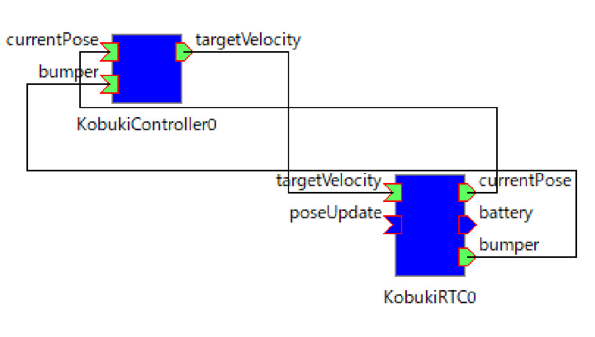
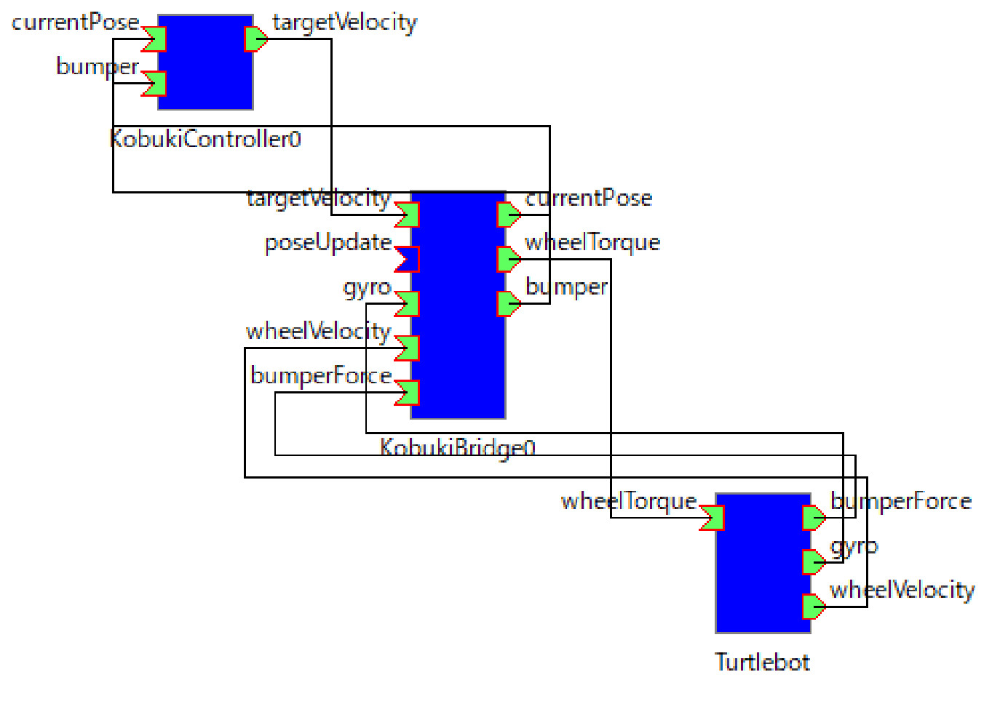

# 事例2: ロボットアームCRANE+の制御

奥野 真之，升谷 保博  
大阪電気通信大学  
2017年12月4日  

アールティ社のロボットアームCRANE+を使用し，手先座標で位置決めをする教材である．手先座標系で作業をプログラムすることを想定しているが，ここでは，単純に手先座標を与えているだけである．

<p></p> 


※ WindowsとLinuxのローカルPCは動作確認したが，リモートPCはWindowsのみ

### 準備物
インストール方法は各サイトを参照．
- DynamixelSDK
  - https://github.com/ROBOTIS-GIT/DynamixelSDK
### 設定ファイル
事例2で使う設定ファイルを以下に示す．

```
common:
  userComps:
       - command: CraneplusController\TkSlider.pyw
         rtc: TkSlider0.rtc
       - command: CraneplusController\TkMonitorSlider.pyw
         rtc: TkMonitorSlider0.rtc
real:
  server:
       192.168.11.100
  userCompConf: 
       rtcR.conf     
  remoteComps:   
      - rtc: CraneplusWrapper0.rtc   
      - rtc: Dynamixel0.rtc    
  connections:
       - TkSlider0.rtc:slider CraneplusWrapper0.rtc:armTipTarget
       - CraneplusWrapper0.rtc:goalPosition Dynamixel0.rtc:goalPosition
       - Dynamixel0.rtc:presentPosition CraneplusWrapper0.rtc:presentPosition
       - Dynamixel0.rtc:moving CraneplusWrapper0.rtc:moving
       - CraneplusWrapper0.rtc:armTip TkMonitorSlider0.rtc:value


sim:
  server: 
       localhost 
  userCompConf: 
       rtc.conf     
  supportComps: 
       -   
         command: CraneplusWrapper\build\src\Release\CraneplusWrapperComp.exe
         rtc: CraneplusWrapper0.rtc   
  choreonoidCommand: choreonoid
  projects:
     -
       path: CraneplusForChoreonoid\craneplus.cnoid
       label: 関節
   
  choreonoidComps: 
       - rtc: DynamixelSim0.rtc  
       - rtc: CRANE.rtc
  connections: 
       - TkSlider0.rtc:slider CraneplusWrapper0.rtc:armTipTarget
       - CraneplusWrapper0.rtc:goalPosition DynamixelSim0.rtc:goalPosition
       - DynamixelSim0.rtc:presentPosition CraneplusWrapper0.rtc:presentPosition
       - DynamixelSim0.rtc:moving CraneplusWrapper0.rtc:moving
       - CraneplusWrapper0.rtc:armTip TkMonitorSlider0.rtc:value
       - CRANE.rtc:angle DynamixelSim0.rtc:angle
       - DynamixelSim0.rtc:torque CRANE.rtc:torque
```

### リモートRTC
- CraneplusWrapper0.rtc  
  - 順，逆運動学を解くRTC
- Dynamixel0.rtc
  - Dynamixelを動かすRTC
  
### シミュレーション

- ロボットアームのモデル
  - RPMのリポジトリのサブモジュールになっている．
  - https://github.com/MasutaniLab/CraneplusForChoreonoid
  - CraneplusForChoreonoidに以下がすべて含まれている．
    - ロボットのモデル（VRMLファイル，拡張子wrl）
    - Choreonoidのプロジェクトファイル（拡張子cnoid）
    - ボディRTCのコントローラモジュール（DynamixelSim，cmakeしてビルドする）

- シミュレーションの設定
  - Choreonoidのプロジェクトファイル
  - CraneplusForChoreonoid/craneplus.cnoid

- 支援RTC
  - CraneplusWrapper0.rtc  
    - 支援RTCはこれのみ
- BodyRTC
  - CRANE.rtc
    - BodyRTC
  - DynamixelSim0.rtc
    - ChoreonoidのBodyRTCのコントローラモジュール
    - CraneplusForChoreonoid/DynamixelSim ディレクトリ以下
    - cmakeで生成
  
- ChoreonoidのBodyRTCの設定ファイル
  - CraneplusForChoreonoid/CRANE.conf  
  
### ユーザRTC

<p> </p> 

- TkSlider
  - 手先座標を指定
- TkMonitorSlider
  - 手先座標を表示

## RTC接続図
左が実機，右がシミュレーション
<p> </p> 
